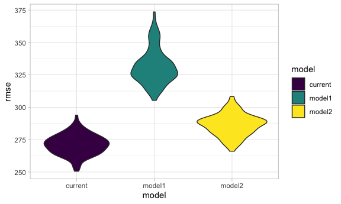
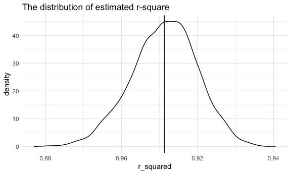
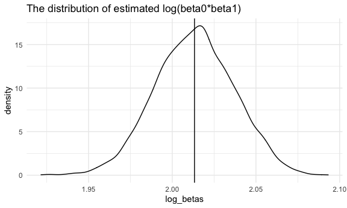

homework 6
================

``` r
library(tidyverse)
```

    ## ── Attaching packages ─────────────────────────────────────── tidyverse 1.3.0 ──

    ## ✓ ggplot2 3.3.2     ✓ purrr   0.3.4
    ## ✓ tibble  3.0.4     ✓ dplyr   1.0.2
    ## ✓ tidyr   1.1.2     ✓ stringr 1.4.0
    ## ✓ readr   1.4.0     ✓ forcats 0.5.0

    ## ── Conflicts ────────────────────────────────────────── tidyverse_conflicts() ──
    ## x dplyr::filter() masks stats::filter()
    ## x dplyr::lag()    masks stats::lag()

``` r
library(modelr)
library(mgcv)
```

    ## Loading required package: nlme

    ## 
    ## Attaching package: 'nlme'

    ## The following object is masked from 'package:dplyr':
    ## 
    ##     collapse

    ## This is mgcv 1.8-33. For overview type 'help("mgcv-package")'.

``` r
knitr::opts_chunk$set(
  fig.width = 6,
  fig.asp = 0.6,
  out.width = "90%"
)

theme_set(theme_minimal() + theme(legend.position = "bottom"))

options(
  ggplot2.continuous.color = "viridis",
  ggplot2.continuous.fill = "viridis"
)

sclae_color_discrete = scale_color_viridis_d
scale_fill_discrete = scale_fill_viridis_d

set.seed(1)
```

## Problem 1 is a lecture example

## Problem 2

##### Import and clean data

``` r
birth_wt = read_csv("./data/birthweight.csv") %>% 
  janitor::clean_names() %>% 
   mutate(
     babysex = as.factor(babysex),
     frace = as.factor(frace),
     malform = as.factor(malform),
     mrace = as.factor(mrace),
     babysex = recode(babysex,"1"="male","2"="female"),
     frace = recode(frace,"1" = "White", "2" = "Black", "3" = "Asian", "4" = "Puerto Rican", "8" = "Other", "9" = "Unknown"),
     malform = recode(malform,"0" = "absent", "1" = "present"),
     mrace = recode(mrace,"1" = "White", "2" = "Black", "3" = "Asian", "4" = "Puerto Rican", "8" = "Other")
     )
```

    ## 
    ## ── Column specification ────────────────────────────────────────────────────────
    ## cols(
    ##   .default = col_double()
    ## )
    ## ℹ Use `spec()` for the full column specifications.

##### Propose a regression model for brthweight

``` r
# first step: fit a model with all the variables 
full_model = lm(bwt ~ ., data = birth_wt)
# perform a backward step-wise elimination 
step(full_model,direction = "backward") 
```

    ## Start:  AIC=48717.83
    ## bwt ~ babysex + bhead + blength + delwt + fincome + frace + gaweeks + 
    ##     malform + menarche + mheight + momage + mrace + parity + 
    ##     pnumlbw + pnumsga + ppbmi + ppwt + smoken + wtgain
    ## 
    ## 
    ## Step:  AIC=48717.83
    ## bwt ~ babysex + bhead + blength + delwt + fincome + frace + gaweeks + 
    ##     malform + menarche + mheight + momage + mrace + parity + 
    ##     pnumlbw + pnumsga + ppbmi + ppwt + smoken
    ## 
    ## 
    ## Step:  AIC=48717.83
    ## bwt ~ babysex + bhead + blength + delwt + fincome + frace + gaweeks + 
    ##     malform + menarche + mheight + momage + mrace + parity + 
    ##     pnumlbw + ppbmi + ppwt + smoken
    ## 
    ## 
    ## Step:  AIC=48717.83
    ## bwt ~ babysex + bhead + blength + delwt + fincome + frace + gaweeks + 
    ##     malform + menarche + mheight + momage + mrace + parity + 
    ##     ppbmi + ppwt + smoken
    ## 
    ##            Df Sum of Sq       RSS   AIC
    ## - frace     4    124365 320848704 48712
    ## - malform   1      1419 320725757 48716
    ## - ppbmi     1      6346 320730684 48716
    ## - momage    1     28661 320752999 48716
    ## - mheight   1     66886 320791224 48717
    ## - menarche  1    111679 320836018 48717
    ## - ppwt      1    131132 320855470 48718
    ## <none>                  320724338 48718
    ## - fincome   1    193454 320917792 48718
    ## - parity    1    413584 321137922 48721
    ## - mrace     3    868321 321592659 48724
    ## - babysex   1    853796 321578134 48727
    ## - gaweeks   1   4611823 325336161 48778
    ## - smoken    1   5076393 325800732 48784
    ## - delwt     1   8008891 328733230 48823
    ## - blength   1 102050296 422774634 49915
    ## - bhead     1 106535716 427260054 49961
    ## 
    ## Step:  AIC=48711.51
    ## bwt ~ babysex + bhead + blength + delwt + fincome + gaweeks + 
    ##     malform + menarche + mheight + momage + mrace + parity + 
    ##     ppbmi + ppwt + smoken
    ## 
    ##            Df Sum of Sq       RSS   AIC
    ## - malform   1      1447 320850151 48710
    ## - ppbmi     1      6975 320855679 48710
    ## - momage    1     28379 320877083 48710
    ## - mheight   1     69502 320918206 48710
    ## - menarche  1    115708 320964411 48711
    ## - ppwt      1    133961 320982665 48711
    ## <none>                  320848704 48712
    ## - fincome   1    194405 321043108 48712
    ## - parity    1    414687 321263390 48715
    ## - babysex   1    852133 321700837 48721
    ## - gaweeks   1   4625208 325473911 48772
    ## - smoken    1   5036389 325885093 48777
    ## - delwt     1   8013099 328861802 48817
    ## - mrace     3  13540415 334389119 48885
    ## - blength   1 101995688 422844392 49908
    ## - bhead     1 106662962 427511666 49956
    ## 
    ## Step:  AIC=48709.53
    ## bwt ~ babysex + bhead + blength + delwt + fincome + gaweeks + 
    ##     menarche + mheight + momage + mrace + parity + ppbmi + ppwt + 
    ##     smoken
    ## 
    ##            Df Sum of Sq       RSS   AIC
    ## - ppbmi     1      6928 320857079 48708
    ## - momage    1     28660 320878811 48708
    ## - mheight   1     69320 320919470 48708
    ## - menarche  1    116027 320966177 48709
    ## - ppwt      1    133894 320984044 48709
    ## <none>                  320850151 48710
    ## - fincome   1    193784 321043934 48710
    ## - parity    1    414482 321264633 48713
    ## - babysex   1    851279 321701430 48719
    ## - gaweeks   1   4624003 325474154 48770
    ## - smoken    1   5035195 325885346 48775
    ## - delwt     1   8029079 328879230 48815
    ## - mrace     3  13553320 334403471 48883
    ## - blength   1 102009225 422859375 49906
    ## - bhead     1 106675331 427525481 49954
    ## 
    ## Step:  AIC=48707.63
    ## bwt ~ babysex + bhead + blength + delwt + fincome + gaweeks + 
    ##     menarche + mheight + momage + mrace + parity + ppwt + smoken
    ## 
    ##            Df Sum of Sq       RSS   AIC
    ## - momage    1     29211 320886290 48706
    ## - menarche  1    117635 320974714 48707
    ## <none>                  320857079 48708
    ## - fincome   1    195199 321052278 48708
    ## - parity    1    412984 321270064 48711
    ## - babysex   1    850020 321707099 48717
    ## - mheight   1   1078673 321935752 48720
    ## - ppwt      1   2934023 323791103 48745
    ## - gaweeks   1   4621504 325478583 48768
    ## - smoken    1   5039368 325896447 48773
    ## - delwt     1   8024939 328882018 48813
    ## - mrace     3  13551444 334408523 48881
    ## - blength   1 102018559 422875638 49904
    ## - bhead     1 106821342 427678421 49953
    ## 
    ## Step:  AIC=48706.02
    ## bwt ~ babysex + bhead + blength + delwt + fincome + gaweeks + 
    ##     menarche + mheight + mrace + parity + ppwt + smoken
    ## 
    ##            Df Sum of Sq       RSS   AIC
    ## - menarche  1    100121 320986412 48705
    ## <none>                  320886290 48706
    ## - fincome   1    240800 321127090 48707
    ## - parity    1    431433 321317724 48710
    ## - babysex   1    841278 321727568 48715
    ## - mheight   1   1076739 321963029 48719
    ## - ppwt      1   2913653 323799943 48743
    ## - gaweeks   1   4676469 325562760 48767
    ## - smoken    1   5045104 325931394 48772
    ## - delwt     1   8000672 328886962 48811
    ## - mrace     3  14667730 335554021 48894
    ## - blength   1 101990556 422876847 49902
    ## - bhead     1 106864308 427750598 49952
    ## 
    ## Step:  AIC=48705.38
    ## bwt ~ babysex + bhead + blength + delwt + fincome + gaweeks + 
    ##     mheight + mrace + parity + ppwt + smoken
    ## 
    ##           Df Sum of Sq       RSS   AIC
    ## <none>                 320986412 48705
    ## - fincome  1    245637 321232048 48707
    ## - parity   1    422770 321409181 48709
    ## - babysex  1    846134 321832545 48715
    ## - mheight  1   1012240 321998651 48717
    ## - ppwt     1   2907049 323893461 48743
    ## - gaweeks  1   4662501 325648912 48766
    ## - smoken   1   5073849 326060260 48771
    ## - delwt    1   8137459 329123871 48812
    ## - mrace    3  14683609 335670021 48894
    ## - blength  1 102191779 423178191 49903
    ## - bhead    1 106779754 427766166 49950

    ## 
    ## Call:
    ## lm(formula = bwt ~ babysex + bhead + blength + delwt + fincome + 
    ##     gaweeks + mheight + mrace + parity + ppwt + smoken, data = birth_wt)
    ## 
    ## Coefficients:
    ##       (Intercept)      babysexfemale              bhead            blength  
    ##         -6098.822             28.558            130.777             74.947  
    ##             delwt            fincome            gaweeks            mheight  
    ##             4.107              0.318             11.592              6.594  
    ##        mraceBlack         mraceAsian  mracePuerto Rican             parity  
    ##          -138.792            -74.887           -100.678             96.305  
    ##              ppwt             smoken  
    ##            -2.676             -4.843

``` r
# according to the output of the backward elimination, the following model has the smallest AIC, so below is my final model for birthweight 
current_model = lm(formula = bwt ~ babysex + bhead + blength + delwt + fincome + 
    gaweeks + mheight + mrace + parity + ppwt + smoken, data = birth_wt)
```

I first fitted a full model that contains all variables. This model can
be used for comparison later one. Then, I used the backward function to
perform a step-wise subtraction to eliminate variables that are not
significantly associated with our outcome of interest, baby’s birth
weight. According to the function output, variable babysex, bhead,
blength, delwt, fincome, gaweeks, mheight, mrace, parity, ppwt, and
smoken should be included into the model. And such model fit our dataset
the best.

##### Plot of model residuals against fitted values

``` r
residuals = add_residuals(birth_wt, current_model)
predictions = add_predictions(birth_wt, current_model)
resid_pred = merge(residuals,predictions)

resid_pred %>% 
  ggplot(aes(x = pred, y = resid, color = bwt)) +
  geom_point(alpha = 0.5) +
  geom_hline(aes(yintercept = 0), color = "red") +
  labs(
    title = "Model residuals against fitted values",
    x = "Predictions",
    y = "Residuals"
  )
```


The residuals are more concentrated near 0 when the predicted values are
larger. When the predicted values are smaller, residuals tend to be a
little bit spread out.

##### Compare your model to two others

``` r
given_model1 = lm(bwt ~ blength + gaweeks, data = birth_wt)
given_model2 = lm(bwt ~ bhead + blength + babysex + bhead*blength + bhead*babysex + blength*babysex + bhead*blength*babysex, data = birth_wt)
```

``` r
cv_df =
  crossv_mc(birth_wt, 100) %>% 
  mutate(
    train = map(train, as_tibble),
    test = map(test, as_tibble))

cv_df = 
  cv_df %>% 
  mutate(
    current_model = map(train, ~lm(
                                   formula = bwt ~ babysex + bhead + blength + delwt + fincome + 
                                   gaweeks + mheight + mrace + parity + ppwt + smoken, data = birth_wt
                                   )),
    given_model1 = map(train, ~lm(
                                  bwt ~ blength + gaweeks, data = birth_wt
                                  )),
    given_model2 = map(train, ~lm(
                                  bwt ~ bhead + blength + babysex + bhead*blength + bhead*babysex +
                                  blength*babysex + bhead*blength*babysex, data = birth_wt
                                  ))
    ) %>% 
  mutate(
    rmse_current = map2_dbl(current_model, test, ~rmse(model = .x, data = .y)),
    rmse_model1 = map2_dbl(given_model1, test, ~rmse(model = .x, data = .y)),
    rmse_model2 = map2_dbl(given_model2, test, ~rmse(model = .x, data = .y)))
```

``` r
cv_df %>%
  select(starts_with("rmse")) %>% 
  pivot_longer(
    everything(),
    names_to = "model",
    values_to = "rmse",
    names_prefix = "rmse_") %>% 
  mutate(model = fct_inorder(model)) %>%
  ggplot(aes(x = model, y = rmse)) +
  geom_violin(aes(fill = model)) + 
  theme_light()
```



``` r
cv_df %>% 
  select(starts_with("rmse")) %>% 
  pivot_longer(
    everything(),
    names_to = "model",
    values_to = "rmse",
    names_prefix = "rmse_") %>%
  group_by(model) %>% 
  summarize(avg_rmse = mean(rmse)) %>% 
  knitr::kable()
```

    ## `summarise()` ungrouping output (override with `.groups` argument)

| model   | avg\_rmse |
| :------ | --------: |
| current |  271.2063 |
| model1  |  331.5183 |
| model2  |  286.4521 |

According to the plot and table, we know that current model has better
predictive capability compared to the two given models.

## Problem 3

##### Import data

``` r
weather_df = 
  rnoaa::meteo_pull_monitors(
    c("USW00094728"),
    var = c("PRCP", "TMIN", "TMAX"), 
    date_min = "2017-01-01",
    date_max = "2017-12-31") %>%
  mutate(
    name = recode(id, USW00094728 = "CentralPark_NY"),
    tmin = tmin / 10,
    tmax = tmax / 10) %>%
  select(name, id, everything())
```

    ## Registered S3 method overwritten by 'hoardr':
    ##   method           from
    ##   print.cache_info httr

    ## using cached file: /Users/jrq/Library/Caches/R/noaa_ghcnd/USW00094728.dly

    ## date created (size, mb): 2020-11-11 12:39:21 (7.531)

    ## file min/max dates: 1869-01-01 / 2020-11-30

##### Produce estimated of the r-square and log(beta0\*beta1)

``` r
boot_straps = 
  weather_df %>% 
  modelr::bootstrap(n = 5000) %>% 
  mutate(
    models = map(strap, ~ lm(tmax ~ tmin, data = .x)),
    r_square = map(models, broom::glance),
    results = map(models, broom::tidy)
    ) %>% 
  select(-strap, -models) %>% 
  #obtain the estimated r-squares
  unnest(r_square, results) %>% 
  janitor::clean_names() 
```

    ## Warning: unnest() has a new interface. See ?unnest for details.
    ## Try `df %>% unnest(c(r_square, results))`, with `mutate()` if needed

``` r
beta_df = 
  boot_straps %>% 
  mutate(term = recode(term, "(Intercept)" = "intercept")) %>% 
  #obtain the estimated betas 
  pivot_wider(
    id_cols = id,
    names_from = term,
    values_from = estimate
  ) %>% 
  mutate(log_betas = log(intercept * tmin))
```

##### Plot the distribution of the r-square and log(beta0\*beta1)

``` r
#plot the distribution of the r-square
boot_straps %>% 
  filter(term == "tmin") %>% 
  ggplot(aes(x = r_squared)) + 
  geom_density() +
  geom_vline(aes(xintercept = mean(r_squared))) +
  labs(
    title = "The distribution of estimated r-square"
  ) 
```



``` r
#plot the distribution of the log(beta0*beta1)
beta_df %>% 
  ggplot(aes(x = log_betas)) + 
  geom_density() +
  geom_vline(aes(xintercept = mean(log_betas))) +
  labs(
    title = "The distribution of estimated log(beta0*beta1)"
  )
```


According to these to plots, we can conclude that the distribution of
the r-square and log(beta0\*beta1) are approximately normal.

##### Identify the 2.5% and 97.5% quantiles to provide a 95% confidence interval for r-square and log(beta0\*beta1)

``` r
#95% confidence interval for r-square
boot_straps %>% 
  filter(term == "tmin") %>% 
  pull(r_squared) %>% 
  quantile(c(0.025, 0.975)) %>% 
  broom::tidy() %>% 
  knitr::kable(digits = 4,
               caption = "The 95% confidence interval for r-square")
```

    ## Warning: 'tidy.numeric' is deprecated.
    ## See help("Deprecated")

    ## Warning: `data_frame()` is deprecated as of tibble 1.1.0.
    ## Please use `tibble()` instead.
    ## This warning is displayed once every 8 hours.
    ## Call `lifecycle::last_warnings()` to see where this warning was generated.

| names |      x |
| :---- | -----: |
| 2.5%  | 0.8937 |
| 97.5% | 0.9275 |

The 95% confidence interval for r-square

``` r
# 95% confidence interval for log(beta0*beta1)
beta_df %>% 
  pull(log_betas) %>% 
  quantile(c(0.025, 0.975)) %>% 
  broom::tidy() %>% 
  knitr::kable(digits = 4,
               caption = "The 95% confidence interval for log(beta0*beta1)")
```

    ## Warning: 'tidy.numeric' is deprecated.
    ## See help("Deprecated")

| names |      x |
| :---- | -----: |
| 2.5%  | 1.9669 |
| 97.5% | 2.0585 |

The 95% confidence interval for log(beta0\*beta1)

The 95% confidence interval for r-square is (0.8937, 0.9275). The 95%
confidence interval for log(beta0\*beta1 is (1.9669, 2.0585).
